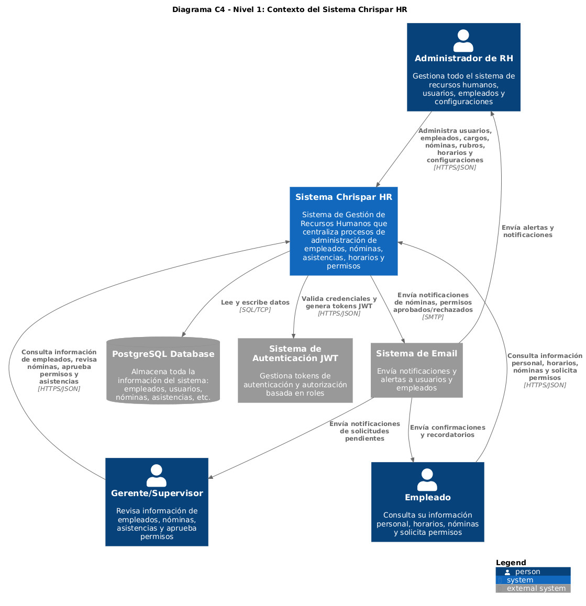
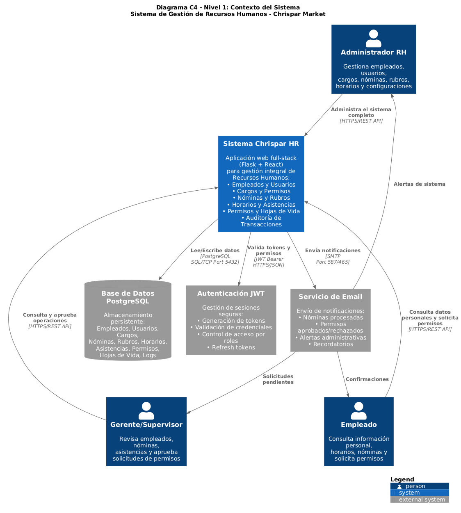
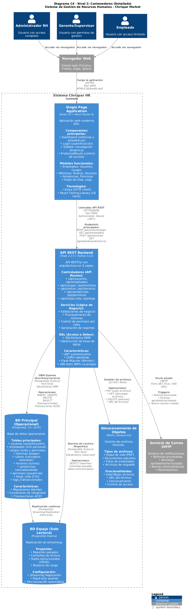

# 📊 Diagramas de Arquitectura - Sistema Chrispar HR

Este directorio contiene los diagramas de arquitectura del Sistema de Gestión de Recursos Humanos Chrispar, utilizando la notación **C4 Model**.

## 📁 Contenido

### C4 Nivel 1: Diagrama de Contexto del Sistema

#### Versión Básica
**Archivo:** `c4-nivel1-contexto.puml`  
**Imagen:** `C4_Context_Diagram.png`



#### Versión Detallada
**Archivo:** `c4-nivel1-contexto-detallado.puml`  
**Imagen:** `C4_Context_Diagram_Detailed.png`



Este diagrama muestra el panorama general del sistema, incluyendo:

---

### C4 Nivel 2: Diagrama de Contenedores

#### Versión Básica
**Archivo:** `c4-nivel2-contenedores.puml`  
**Imagen:** `C4_Container_Diagram.png`


#### Versión Detallada
**Archivo:** `c4-nivel2-contenedores-detallado.puml`  
**Imagen:** `C4_Container_Diagram_Detailed.png`



Este diagrama muestra la estructura técnica del sistema en términos de contenedores de aplicación, incluyendo:

#### 🌐 Contenedores de la Aplicación

1. **Single Page Application (SPA) - Frontend**
   - **Tecnología:** React 19 + React Router 6
   - **Puerto:** 3000
   - **Componentes principales:**
     - Dashboard (métricas y estadísticas)
     - Login (autenticación)
     - Sidebar (navegación dinámica según permisos)
     - ProtectedRoute (control de acceso)
   - **Módulos funcionales:**
     - Empleados, Usuarios, Cargos
     - Nóminas, Rubros, Horarios
     - Asistencias, Permisos
     - Hojas de Vida, Logs
   - **Herramientas:**
     - Axios (cliente HTTP)
     - React Testing Library (20 tests)

2. **API REST - Backend**
   - **Tecnología:** Flask 2.2.5 + Python 3.12
   - **Puerto:** 5000
   - **Arquitectura:** Blueprints (rutas modulares)
   - **Endpoints principales:**
     - `/api/usuarios` (login, CRUD)
     - `/api/empleados` (gestión de empleados)
     - `/api/cargos` (permisos por rol)
     - `/api/nominas` (procesamiento de nóminas)
     - `/api/rubros` (devengos y deducciones)
     - `/api/horarios` (turnos de trabajo)
     - `/api/asistencias` (control de entrada/salida)
     - `/api/permisos` (solicitudes de ausencias)
     - `/api/hojas-vida` (CVs)
     - `/api/logs` (auditoría)
   - **Características:**
     - Autenticación JWT
     - CORS habilitado
     - SQLAlchemy ORM
     - Flask-Migrate (Alembic)
     - 186 tests automatizados (88% cobertura)

3. **Base de Datos - PostgreSQL**
   - **Versión:** PostgreSQL 14+
   - **Puerto:** 5432
   - **Tablas principales:**
     - usuarios (autenticación)
     - empleados (información personal)
     - cargos (roles y permisos)
     - nominas (pagos)
     - rubros (conceptos salariales)
     - horarios (turnos de trabajo)
     - asistencias (entrada/salida)
     - permisos (ausencias)
     - hojas_vida (CVs)
     - logs_transaccionales (auditoría)
   - **Gestión:**
     - Migraciones versionadas con Alembic
     - Constraints de integridad referencial

#### 🔄 Flujo de Comunicación entre Contenedores

1. **Usuario → Navegador Web**
   - Usuarios acceden vía navegadores modernos (Chrome, Firefox, Edge, Safari)

2. **Navegador → SPA Frontend**
   - **Protocolo:** HTTPS
   - **Puerto:** 3000
   - **Formato:** HTML/CSS/JavaScript

3. **SPA → API REST**
   - **Protocolo:** HTTPS/REST
   - **Puerto:** 5000
   - **Formato:** JSON
   - **Autenticación:** JWT Bearer Token
   - **Operaciones:** GET, POST, PUT, DELETE

4. **API REST → Base de Datos**
   - **Protocolo:** PostgreSQL Protocol (SQL/TCP)
   - **Puerto:** 5432
   - **ORM:** SQLAlchemy
   - **Operaciones:** SELECT, INSERT, UPDATE, DELETE
   - **Transacciones:** ACID

5. **API REST → Servicio de Email**
   - **Protocolo:** SMTP
   - **Puertos:** 587 (TLS) / 465 (SSL)
   - **Triggers:**
     - Nómina procesada
     - Permiso aprobado/rechazado
     - Nuevo usuario creado

---

### C4 Nivel 1: Contexto del Sistema (Continuación)

#### 🎭 Actores Externos (Personas)
1. **Administrador de RH**
   - Gestiona todo el sistema de recursos humanos
   - Administra usuarios, empleados, cargos y configuraciones
   - Procesa nóminas y gestiona rubros salariales
   - Configura horarios y revisa asistencias

2. **Gerente/Supervisor**
   - Revisa información de empleados bajo su cargo
   - Consulta nóminas y asistencias
   - Aprueba o rechaza solicitudes de permisos
   - Accede a reportes y estadísticas

3. **Empleado**
   - Consulta su información personal y hoja de vida
   - Revisa sus horarios de trabajo
   - Consulta sus nóminas y liquidaciones
   - Solicita permisos y ausencias
   - Registra asistencias

#### 🖥️ Sistema Principal
**Sistema Chrispar HR**
- Sistema web full-stack (Flask + React)
- Gestión centralizada de:
  - Empleados y usuarios
  - Cargos y permisos
  - Nóminas y rubros salariales
  - Horarios de trabajo
  - Asistencias y control de entrada/salida
  - Permisos y ausencias
  - Hojas de vida
  - Logs de auditoría

#### 🔗 Sistemas Externos
1. **PostgreSQL Database**
   - Base de datos relacional principal
   - Almacena toda la información del sistema
   - Tablas: usuarios, empleados, cargos, nóminas, rubros, horarios, asistencias, permisos, hojas_vida, logs

2. **Sistema de Email**
   - Envío de notificaciones automáticas
   - Alertas de nóminas procesadas
   - Notificaciones de permisos aprobados/rechazados
   - Recordatorios de cumpleaños y fechas importantes

3. **Sistema de Autenticación JWT**
   - Gestión de tokens de autenticación
   - Autorización basada en roles
   - Control de acceso a recursos según permisos del cargo

#### 🔄 Relaciones Principales
- **Usuarios → Sistema Chrispar HR**: Interacción vía web (HTTPS/JSON)
- **Sistema → PostgreSQL**: Operaciones CRUD (SQL/TCP)
- **Sistema → Email**: Envío de notificaciones (SMTP)
- **Sistema → JWT Auth**: Validación de credenciales y generación de tokens (HTTPS/JSON)
- **Email → Usuarios**: Notificaciones y alertas por correo electrónico

## 🛠️ Cómo Visualizar los Diagramas

### Opción 1: PlantUML Online (Recomendado)
1. Visita [PlantUML Online Server](http://www.plantuml.com/plantuml/uml/)
2. Copia el contenido del archivo `.puml`
3. Pega en el editor online
4. El diagrama se generará automáticamente

### Opción 2: Visual Studio Code con PlantUML
1. Instala la extensión "PlantUML" de jebbs
2. Abre el archivo `.puml` en VS Code
3. Presiona `Alt+D` para ver la vista previa
4. O usa el comando: "PlantUML: Preview Current Diagram"

### Opción 3: Generar Imagen Localmente

#### Requisitos:
- Java JRE 8 o superior
- GraphViz (opcional, mejora la renderización)

#### Instalación de PlantUML:
```bash
# Windows (con Chocolatey)
choco install plantuml

# macOS (con Homebrew)
brew install plantuml

# Linux (Ubuntu/Debian)
sudo apt-get install plantuml
```

#### Generar PNG:
```bash
plantuml c4-nivel1-contexto.puml
```

#### Generar SVG (recomendado para web):
```bash
plantuml -tsvg c4-nivel1-contexto.puml
```

## 📚 Modelo C4

El modelo C4 (Context, Containers, Components, Code) es un enfoque para visualizar la arquitectura de software en diferentes niveles de abstracción:

- **Nivel 1 - Contexto**: Vista general del sistema y sus relaciones (este diagrama)
- **Nivel 2 - Contenedores**: Aplicaciones y almacenes de datos (próximo)
- **Nivel 3 - Componentes**: Componentes dentro de cada contenedor
- **Nivel 4 - Código**: Diagramas de clases (opcional)

## 🔗 Referencias
- [C4 Model](https://c4model.com/)
- [C4-PlantUML](https://github.com/plantuml-stdlib/C4-PlantUML)
- [PlantUML Documentation](https://plantuml.com/)

## 📝 Notas
- Los diagramas se actualizan conforme evoluciona el sistema
- Última actualización: Diciembre 2025
- Mantenedor: Equipo de Desarrollo Chrispar HR
