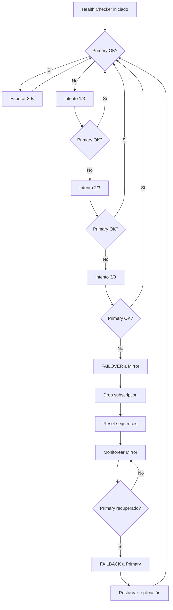

# Guía de Failover Automático

## 🎯 Descripción
Sistema automatizado de alta disponibilidad que detecta fallos en la base de datos principal y cambia automáticamente al mirror.

## 📋 Componentes

### 1. **Health Checker Automático** (`backend/utils/health_checker.py`)
- Monitorea continuamente la base de datos principal
- Detecta fallos automáticamente
- Ejecuta failover cuando sea necesario
- Restaura al primary cuando vuelve a estar disponible

### 2. **Script de Failover Manual** (`scripts/failover_to_mirror.ps1`)
- Permite ejecutar failover manualmente
- Útil para mantenimiento planificado
- Incluye verificación de estado

### 3. **Script de Failback** (`scripts/failback_to_primary.ps1`)
- Restaura la operación al primary
- Reconfigura la replicación
- Valida que todo funcione correctamente

## 🚀 Modo de Uso

### Failover Automático (Recomendado)

El sistema está configurado para funcionar automáticamente. Solo necesitas:

```powershell
# 1. Asegúrate de que el backend esté corriendo
docker-compose up -d

# 2. El health checker se activa automáticamente
# Verifica el estado en: http://localhost:5000/api/health
```

**Configuración** (en `backend/.env`):
```env
AUTO_FAILOVER_ENABLED=true          # Habilita failover automático
HEALTH_CHECK_INTERVAL=30            # Verifica cada 30 segundos
HEALTH_CHECK_MAX_RETRIES=3          # 3 fallos antes de failover
HEALTH_CHECK_TIMEOUT=5              # Timeout de 5 segundos
```

### Failover Manual

```powershell
# Cambiar manualmente al mirror
.\scripts\failover_to_mirror.ps1

# Verificar estado
docker ps --filter "name=postgres" --format "table {{.Names}}\t{{.Status}}\t{{.Ports}}"
```

### Failback Manual

```powershell
# Volver al primary cuando esté disponible
.\scripts\failback_to_primary.ps1
```

## 🔍 Monitoreo

### Verificar Estado Actual

```powershell
# Ver estado del health check
curl http://localhost:5000/api/health

# Respuesta esperada:
# {
#   "status": "healthy",
#   "database": "primary",
#   "timestamp": "2026-01-08T10:30:00"
# }
```

### Logs del Backend

```powershell
# Ver logs en tiempo real
docker logs -f chrispar_backend

# Buscar eventos de failover
docker logs chrispar_backend | Select-String "FAILOVER"
```

## 📊 Flujo de Failover Automático



## ⚙️ Qué hace cada paso del Failover

### 1. Detección de Fallo
- Health checker detecta que primary no responde
- Registra el error en logs
- Incrementa contador de fallos

### 2. Cambio al Mirror
```sql
-- Deshabilita la suscripción
DROP SUBSCRIPTION IF EXISTS chrispar_sub;

-- Resetea las secuencias para IDs
SELECT setval(pg_get_serial_sequence('usuarios', 'id'), COALESCE(MAX(id), 1)) FROM usuarios;
SELECT setval(pg_get_serial_sequence('empleados', 'id'), COALESCE(MAX(id), 1)) FROM empleados;
-- ... (todas las tablas)
```

### 3. Actualización de Configuración
- Cambia `DATABASE_URL` en memoria (sin modificar .env)
- Reinicia el pool de conexiones
- Valida conectividad con mirror

### 4. Monitoreo Post-Failover
- Continúa monitoreando primary
- Detecta cuando primary vuelve a estar disponible
- Ejecuta failback automáticamente (opcional)

## 🛠️ Troubleshooting

### El health checker no se inicia

```powershell
# Verifica que las variables estén en .env
cat backend\.env | Select-String "AUTO_FAILOVER"

# Reinicia el backend
docker-compose restart backend
```

### Failover no funciona

```powershell
# Verifica conectividad al mirror
docker exec chrispar_backend psql -h postgres_mirror -U postgres -d chrispar -c "SELECT 1"

# Revisa logs
docker logs chrispar_backend --tail 100
```

### Mirror no tiene datos recientes

```powershell
# Verifica estado de replicación
docker exec chrispar_postgres_primary psql -U postgres -d chrispar -c "SELECT * FROM pg_stat_replication;"

# Re-configura replicación si es necesario
docker-compose restart replication_setup
```

### Backend no cambia al mirror

```powershell
# Verifica que MIRROR_DATABASE_URL esté configurado
docker exec chrispar_backend env | Select-String "MIRROR"

# Fuerza failover manual
.\scripts\failover_to_mirror.ps1
```

## 📈 Mejores Prácticas

1. **Monitoreo Regular**: Revisa los logs del health checker diariamente
2. **Pruebas Programadas**: Simula fallos mensualmente para validar el sistema
3. **Backups**: Mantén backups regulares de ambas bases de datos
4. **Alertas**: Considera integrar notificaciones (email, Slack, etc.)
5. **Documentación**: Actualiza esta guía con cambios en tu infraestructura

## 🔔 Notificaciones (Futuro)

Para agregar notificaciones, edita `backend/utils/health_checker.py`:

```python
def send_alert(self, message):
    # Implementa tu sistema de alertas aquí
    # Ejemplos:
    # - Enviar email
    # - Notificar a Slack
    # - Llamar webhook
    pass
```

## 🧪 Pruebas

### Simular Fallo del Primary

```powershell
# Detén el primary
docker stop chrispar_postgres_primary

# Espera ~90 segundos (3 intentos x 30s)
# El sistema debería hacer failover automáticamente

# Verifica que está usando mirror
curl http://localhost:5000/api/health
# Respuesta: {"database": "mirror", ...}

# Recupera el primary
docker start chrispar_postgres_primary

# El sistema debería hacer failback automáticamente
```

## 📝 Notas Importantes

- El failover automático **no modifica** el archivo `.env`
- Los cambios se hacen en memoria para evitar conflictos
- Al reiniciar el contenedor, vuelve a la configuración de `.env`
- Para failover permanente, usa los scripts manuales
